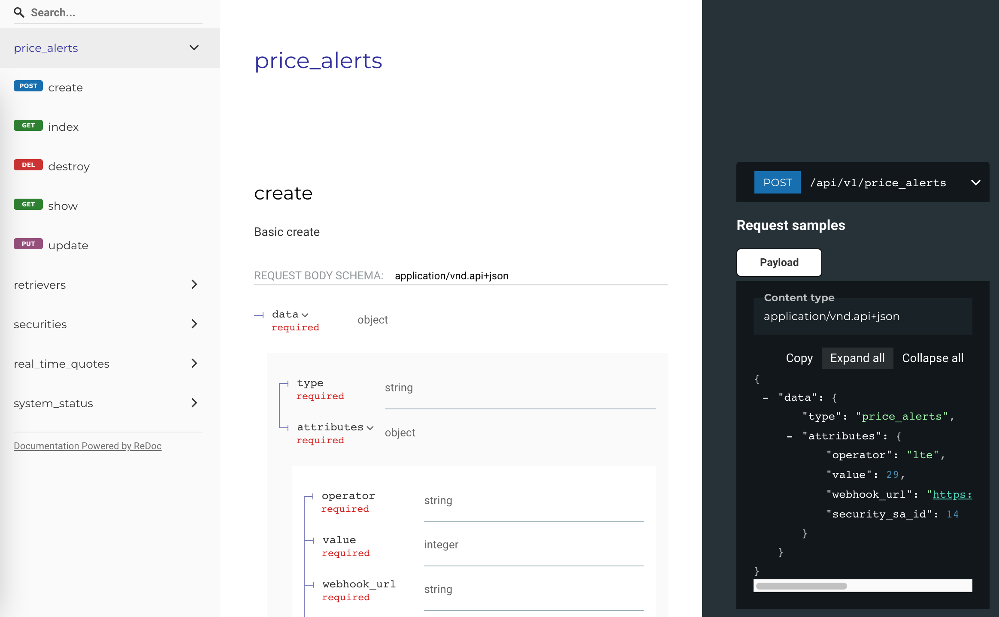

# LazyApiDoc

A library to generate OpenAPI V3 documentation from tests. Try out the results 
[here](https://bguban.github.io/lazy_api_doc/example).

LazyApiDoc collects requests and responses from your controller and request specs, retrieves data types, optional 
attributes, endpoint description and then generates OpenAPI documentation. 



## Installation

Add this line to your application's Gemfile:

```ruby
gem 'lazy_api_doc', require: false, group: :test
```

And then execute:

    $ bundle install

Or install it yourself as:

    $ gem install lazy_api_doc

Then run install task

    $ rails g lazy_api_doc:install

## Configuration

You can customize LazyApiDoc behavior using config file or environment variables.

```yaml
# config/lazy_api_doc.yml

# base directory for storing layout files and generated documentation
path: 'doc/lazy_api_doc' # ENV['LAZY_API_DOC_PATH'] default: 'public/lazy_api_doc'

# TTL for files generated by running tests in different processes (ParallelTest). Each process generates a file.
# After all the processes are done one of them collects all example files and generates the documentation. In case 
# when the example files were not deleted before running the tests, old files will be ignored.
example_file_ttl: 1800 # ENV['LAZY_API_DOC_EXAMPLE_FILE_TTL'] default: 1800 (30 minutes)
```

## Usage

Update files `public/lazy_api_doc/index.html` and `public/lazy_api_doc/layout.yml`. These files will be 
used as templates to show the documentation. You need to set your application name, description and
so on.

And just run your tests with `DOC=true` environment variable:

    $ LAZY_API_DOC=true rspec

or

    # LAZY_API_DOC=true rake test

The documentation will be placed `public/lazy_api_doc/api.yml`. To see it just run server

    $ rails server
    
and navigate to http://localhost:3000/lazy_api_doc/

## How does it work under the hood?

LazyApiDoc gathers your test requests and responses, group them by controllers and actions that were affected, and tries to guess the type of every field.
```json
user: {
 id: 1, // Integer
 name: "John Doe", // String,
 created_at: "2020-05-17 20:15:47Z -0400" // DateTime
}
``` 
After that, it just builds an OpenAPI specification based on it.

## Contributing

Bug reports and pull requests are welcome on GitHub at https://github.com/bguban/lazy_api_doc. This project is intended 
to be a safe, welcoming space for collaboration, and contributors are expected to adhere to 
the [code of conduct](https://github.com/bguban/lazy_api_doc/blob/master/CODE_OF_CONDUCT.md).


## License

The gem is available as open source under the terms of the [MIT License](https://opensource.org/licenses/MIT).

## Code of Conduct

Everyone interacting in the LazyApiDoc project's codebases, issue trackers, chat rooms and mailing lists is expected to 
follow the [code of conduct](https://github.com/bguban/lazy_api_doc/blob/master/CODE_OF_CONDUCT.md).
